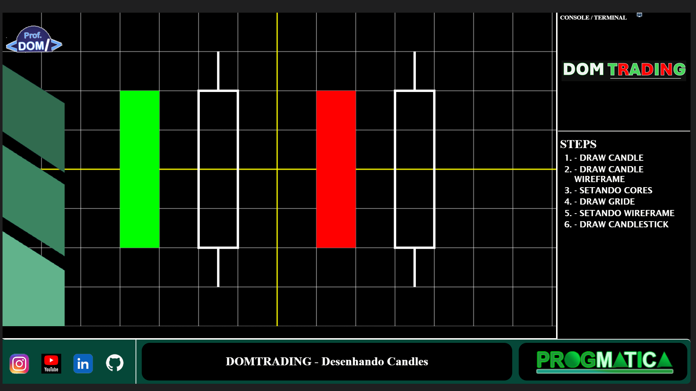

# CHALLENGE 1 - DESENHANDO CANDLES - DOMTRADING 2025 

<figure>
 
 <figcaption>CHALLENGE #1 - DOMTRADING 2025</figcaption> 
</figure>

## 1 - SOBRE
NESTE PRIMEIRO CHALLENGE DESTA NOSSA SÉRIE, VAMOS CONHECER E DESENHAR NOSSOS PRIMEIROS CANDLE E CANDLESTICKS, UTILIZANDO O ELEMENTO <CANVAS> DO HTML 5.  

## 2 - DESENVOLVIMENTO - STEPS
- STEP 1 - CANDLE SÓLIDO    
- STEP 2 - CANDLE WIREFRAME 
- STEP 3 - SETANDO CORES    
- STEP 4 - DRAW GRIDE       
- STEP 5 - SETANDO CANDLES  
- STEP 6 - DRAW CANDLESTICK 
