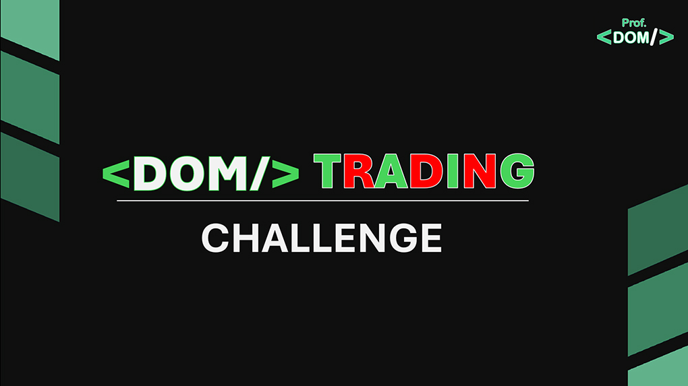

# DOMTRADING - CHALLENGE 2025

<figure>
 
 <figcaption>Capa DOMTRADING 2025</figcaption> 
</figure>

# SOBRE
DOMTRADING CHALLENGE - Desenvolver os famosos Gráficos de Candle(Velas), muito utilizados em Sistemas do Mercado Financeiro, utilizando o Elemento <canvas> do HTML 5.  

### TECNOLOGIAS UTILIZADAS
- HTML 5
- CSS
- Javascript

# CHALLENGES
 ### #0 - APRESENTAÇÃO.
 ### #1 - DESENHANDO CANDLES.
 ### #2 - DESENHANDO CANDLESTICK. < EM BREVE >
   